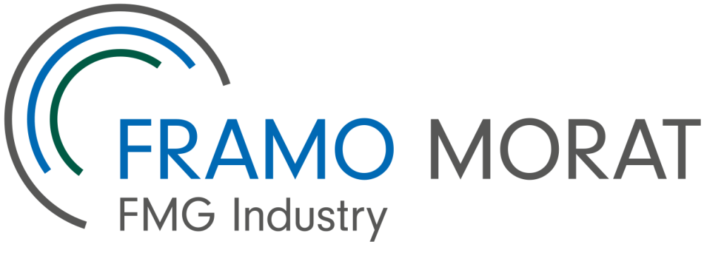

<!--
  Org-Profil-README  →  gehört nach:  .github/profile/README.md
  Vor dem Commit anzupassen: Logo-Asset unter profile/assets/, Repo-Tabelle, Kontakt-Mail.
-->

# Framo Morat

**Franz Morat Group · Antriebstechnik aus dem Hochschwarzwald**
Interne Software-Tools rund um Zahnräder, Getriebe und Antriebssysteme.

---

## Wer wir sind

**Framo Morat** entwickelt und fertigt hochpräzise Zahnräder, Getriebekomponenten und komplette Antriebssysteme für die Industrie – von Automatisierung und Intralogistik über Medizin- und Rehatechnik bis zu erneuerbaren Energien und Landtechnik. Zusammen mit **F. Morat** (Automotive) bildet Framo Morat die **Franz Morat Group** mit Stammsitz in Eisenbach im Hochschwarzwald.

| Kennzahl | Wert |
|---|---:|
| Erfahrung Metallverarbeitung | über 110 Jahre |
| Mitarbeitende | über 700 |
| Umsatz | rund 115 Mio. € |
| Tochterfirmen | USA, Polen, Mexiko, Türkei |

---

## Kontakt

Fragen zu Repositories oder Tools dieser Organisation? Die passenden Ansprechpartner für **Software**, **Prüflabor** und **IT-Infrastruktur** findest du im [Support-Leitfaden](https://github.com/Franz-Morat-Group/.github/blob/main/SUPPORT.md). Allgemeine IT-Anfragen: **itteamapplication@franz-morat.com** · Allgemeine Unternehmensanfragen über [franz-morat.com](https://franz-morat.com).

Franz Morat Group · Eisenbach im Hochschwarzwald · Ihre Idee – Unser Antrieb

